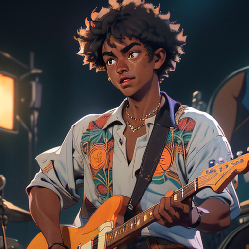
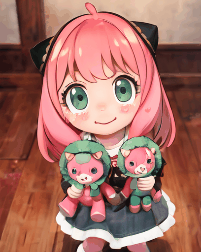

# CVPR 2024 | PIA：Personalized Image Animator

[**PIA: Your Personalized Image Animator via Plug-and-Play Modules in Text-to-Image Models**](https://arxiv.org/abs/2312.13964)

[Yiming Zhang*](https://github.com/ymzhang0319), [Zhening Xing*](https://github.com/LeoXing1996/), [Yanhong Zeng†](https://zengyh1900.github.io/), [Youqing Fang](https://github.com/FangYouqing), [Kai Chen†](https://chenkai.site/)

(*equal contribution, †corresponding Author)


[](https://arxiv.org/abs/2312.13964)
[](https://pi-animator.github.io)
[](https://openxlab.org.cn/apps/detail/zhangyiming/PiaPia)
[](https://colab.research.google.com/github/camenduru/PIA-colab/blob/main/PIA_colab.ipynb)
[](https://huggingface.co/Leoxing/PIA)
<a target="_blank" href="https://huggingface.co/spaces/Leoxing/PIA">
  
</a>
[](https://replicate.com/cjwbw/pia)


PIA is a personalized image animation method which can generate videos with **high motion controllability** and **strong text and image alignment**.

If you find our project helpful, please give it a star :star: or [cite](#bibtex) it, we would be very grateful :sparkling_heart: .


## What's New
- [x] `2024/01/03` [Replicate Demo & API](https://replicate.com/cjwbw/pia) support!
- [x] `2024/01/03` [Colab](https://github.com/camenduru/PIA-colab) support from [camenduru](https://github.com/camenduru)!
- [x] `2023/12/28` Support `scaled_dot_product_attention` for 1024x1024 images with just 16GB of GPU memory.
- [x] `2023/12/25` HuggingFace demo is available now! [🤗 Hub](https://huggingface.co/spaces/Leoxing/PIA/)
- [x] `2023/12/22` Release the demo of PIA on [OpenXLab](https://openxlab.org.cn/apps/detail/zhangyiming/PiaPia) and checkpoints on [Google Drive](https://drive.google.com/file/d/1RL3Fp0Q6pMD8PbGPULYUnvjqyRQXGHwN/view?usp=drive_link) or [](https://openxlab.org.cn/models/detail/zhangyiming/PIA)

## Setup
### Prepare Environment

Use the following command to install a conda environment for PIA from scratch:

```
conda env create -f pia.yml
conda activate pia
```
You may also want to install it based on an existing environment, then you can use `environment-pt2.yaml` for Pytorch==2.0.0. If you want to use lower version of Pytorch (e.g. 1.13.1), you can use the following command:

```
conda env create -f environment.yaml
conda activate pia
```

We strongly recommend you to use Pytorch==2.0.0 which supports `scaled_dot_product_attention` for memory-efficient image animation.

### Download checkpoints
<li>Download the Stable Diffusion v1-5</li>

```
conda install git-lfs
git lfs install
git clone https://huggingface.co/runwayml/stable-diffusion-v1-5 models/StableDiffusion/
```

<li>Download PIA</li>

```
git clone https://huggingface.co/Leoxing/PIA models/PIA/
```

<li>Download Personalized Models</li>

```
bash download_bashscripts/1-RealisticVision.sh
bash download_bashscripts/2-RcnzCartoon.sh
bash download_bashscripts/3-MajicMix.sh
```


You can also download *pia.ckpt* manually through link on [Google Drive](https://drive.google.com/file/d/1RL3Fp0Q6pMD8PbGPULYUnvjqyRQXGHwN/view?usp=drive_link)
or [HuggingFace](https://huggingface.co/Leoxing/PIA).

Put checkpoints as follows:
```
└── models
    ├── DreamBooth_LoRA
    │   ├── ...
    ├── PIA
    │   ├── pia.ckpt
    └── StableDiffusion
        ├── vae
        ├── unet
        └── ...
```

## Inference
### Image Animation
Image to Video result can be obtained by:
```
python inference.py --config=example/config/lighthouse.yaml
python inference.py --config=example/config/harry.yaml
python inference.py --config=example/config/majic_girl.yaml
```
Run the command above, then you can find the results in example/result:
<table class="center">
    <tr>
      <td><p style="text-align: center">Input Image</p></td>
      <td><p style="text-align: center">lightning, lighthouse</p></td>
      <td><p style="text-align: center">sun rising, lighthouse</p></td>
      <td><p style="text-align: center">fireworks, lighthouse</p></td>
    </tr>
    <tr>
      <td></td>
      <td></td>
      <td></td>
      <td></td>
    </tr>
    <tr>
      <td><p style="text-align: center">Input Image</p></td>
      <td><p style="text-align: center">1boy smiling</p></td>
      <td><p style="text-align: center">1boy playing the magic fire</p></td>
      <td><p style="text-align: center">1boy is waving hands</p></td>
    </tr>
    <tr>
      <td></td>
      <td></td>
      <td></td>
      <td></td>
    </tr>
    <tr>
      <td><p style="text-align: center">Input Image</p></td>
      <td><p style="text-align: center">1girl is smiling</p></td>
      <td><p style="text-align: center">1girl is crying</p></td>
      <td><p style="text-align: center">1girl, snowing </p></td>
    </tr>
    <tr>
      <td></td>
      <td></td>
      <td></td>
      <td></td>
    </tr>

</table>

<!-- More results:

<table class="center">
    <tr>
      <td><p style="text-align: center">Input Image</p></td>
    </tr>
    <tr>
    </tr>
</table> -->

### Motion Magnitude
You can control the motion magnitude through the parameter **magnitude**:
```sh
python inference.py --config=example/config/xxx.yaml --magnitude=0 # Small Motion
python inference.py --config=example/config/xxx.yaml --magnitude=1 # Moderate Motion
python inference.py --config=example/config/xxx.yaml --magnitude=2 # Large Motion
```
Examples:

```sh
python inference.py --config=example/config/labrador.yaml
python inference.py --config=example/config/bear.yaml
python inference.py --config=example/config/genshin.yaml
```

<table class="center">
    <tr>
      <td><p style="text-align: center">Input Image<br>& Prompt</p></td>
      <td><p style="text-align: center">Small Motion</p></td>
      <td><p style="text-align: center">Moderate Motion</p></td>
      <td><p style="text-align: center">Large Motion</p></td>
    </tr>
    <tr>
    <td>a golden labrador is running</td>
     <td></td>
      <td></td>
      <td></td>
    </tr>
    <tr>
    <td>1bear is walking, ...</td>
     <td></td>
      <td></td>
      <td></td>
    </tr>
    <tr>
    <td>cherry blossom, ...</td>
     <td></td>
      <td></td>
      <td></td>
    </tr>
</table>

### Style Transfer
To achieve style transfer, you can run the command(*Please don't forget set the base model in xxx.yaml*):

Examples:

```sh
python inference.py --config example/config/concert.yaml --style_transfer
python inference.py --config example/config/anya.yaml --style_transfer
```
<table class="center">
    <tr>
      <td><p style="text-align: center">Input Image<br> & Base Model</p></td>
      <td><p style="text-align: center">1man is smiling</p></td>
      <td><p style="text-align: center">1man is crying</p></td>
      <td><p style="text-align: center">1man is singing</p></td>
    </tr>
    <tr>
      <td style="text-align: center">Realistic Vision</td>
      <td></td>
      <td></td>
      <td></td>
    </tr>
    <tr>
      <td style="text-align: center">RCNZ Cartoon 3d</td>
      <td></td>
      <td></td>
      <td></td>
    </tr>
    <tr>
      <td><p style="text-align: center"></p></td>
      <td><p style="text-align: center">1girl smiling</p></td>
      <td><p style="text-align: center">1girl open mouth</p></td>
      <td><p style="text-align: center">1girl is crying, pout</p></td>
    </tr>
    <tr>
      <td style="text-align: center">RCNZ Cartoon 3d</td>
      <td></td>
      <td></td>
      <td></td>
    </tr>
</table>

### Loop Video

You can generate loop by using the parameter --loop

```sh
python inference.py --config=example/config/xxx.yaml --loop
```

Examples:
```sh
python inference.py --config=example/config/lighthouse.yaml --loop
python inference.py --config=example/config/labrador.yaml --loop
```

<table>
  <tr>
    <td><p style="text-align: center">Input Image</p></td>
    <td><p style="text-align: center">lightning, lighthouse</p></td>
    <td><p style="text-align: center">sun rising, lighthouse</p></td>
    <td><p style="text-align: center">fireworks, lighthouse</p></td>
  </tr>
  <tr>
    <td style="text-align: center"></td>
    <td></td>
    <td></td>
    <td></td>
  </tr>
  <tr>
    <td><p style="text-align: center">Input Image</p></td>
    <td><p style="text-align: center">labrador jumping</p></td>
    <td><p style="text-align: center">labrador walking</p></td>
    <td><p style="text-align: center">labrador running</p></td>
  </tr>
  <tr>
    <td style="text-align: center"></td>
    <td></td>
    <td></td>
    <td></td>
  </tr>
</table>


## Training

We provide [training script]("train.py") for PIA. It borrows from [AnimateDiff](https://github.com/guoyww/AnimateDiff/tree/main) heavily, so please prepare the dataset and configuration files according to the [guideline](https://github.com/guoyww/AnimateDiff/blob/main/__assets__/docs/animatediff.md#steps-for-training).

After preparation, you can train the model by running the following command using torchrun:

```shell
torchrun --nnodes=1 --nproc_per_node=1 train.py --config example/config/train.yaml
```

or by slurm,
```shell
srun --quotatype=reserved --job-name=pia --gres=gpu:8 --ntasks-per-node=8 --ntasks=8  --cpus-per-task=4 --kill-on-bad-exit=1 python train.py --config example/config/train.yaml
```


## AnimateBench
We have open-sourced AnimateBench on [HuggingFace](https://huggingface.co/datasets/ymzhang319/AnimateBench) which includes images, prompts and configs to evaluate PIA and other image animation methods.


## BibTex
```
@inproceedings{zhang2024pia,
  title={Pia: Your personalized image animator via plug-and-play modules in text-to-image models},
  author={Zhang, Yiming and Xing, Zhening and Zeng, Yanhong and Fang, Youqing and Chen, Kai},
  booktitle={Proceedings of the IEEE/CVF Conference on Computer Vision and Pattern Recognition},
  pages={7747--7756},
  year={2024}
}
```


## Contact Us
**Yiming Zhang**: zhangyiming@pjlab.org.cn

**Zhening Xing**: xingzhening@pjlab.org.cn

**Yanhong Zeng**: zengyh1900@gmail.com

## Acknowledgements
The code is built upon [AnimateDiff](https://github.com/guoyww/AnimateDiff), [Tune-a-Video](https://github.com/showlab/Tune-A-Video) and [PySceneDetect](https://github.com/Breakthrough/PySceneDetect)

You may also want to try other project from our team:
<a target="_blank" href="https://github.com/open-mmlab/mmagic">
  
</a>
